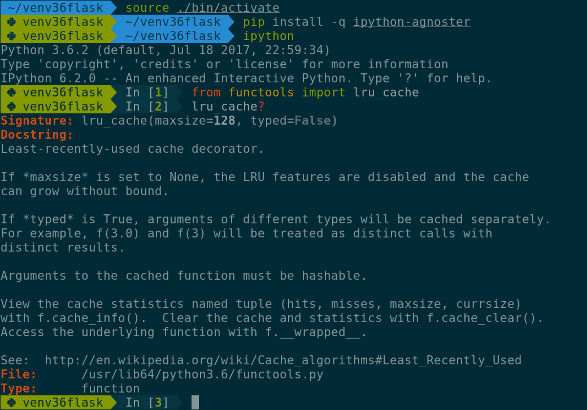

# IPython Agnoster theme

IPython Agnoster (aka IPster) is a hipster theme for the IPython REPL.
It was designed to provide a consistent terminal experience around
[Agnoster Zsh theme](https://github.com/i5ar/agnoster-zsh-theme) fork.

IPster is optimized for people who use:

- Solarized colorscheme;
- Unicode-compatible fonts.

For GNOME GNU/Linux users, I highly recommend GNOME Terminal + Solarized dark + DejaVu Sans Mono Nerd.  
For KDE GNU/Linux users, I highly recommend Konsole + [Solarized Dark](https://github.com/phiggins/konsole-colors-solarized) + DejaVu Sans Mono Nerd.  
For Mac users, I highly recommend iTerm 2 + Solarized Dark.

> With some extra hassle this theme works on Windows too.

Meet all the family:

- [Agnoster Zsh theme](https://github.com/i5ar/agnoster-zsh-theme) fork;
- Agnoster Zsh theme [Vi mode plugin](https://gist.github.com/i5ar/d7c4a595679dfb0c4cbae14e21f45454);
- [Agnoster Vim statusline](https://github.com/i5ar/vim-agnoster-statusline) (aka Vister);
- [Agnoster Tmux theme](https://github.com/i5ar/tmux-colors-solarized) fork;

## Screenshot

## Installation

For ``IPython>=5.0`` install the package:

    pip install -U pip setuptools  # update environment markers support
    pip install ipython-agnoster

For ``IPython>=0.11,<5.0`` clone the repository and copy the ``ipster`` module
to the extensions directory (deprecated):

    git clone --depth=1 https://github.com/i5ar/ipster.git
    cd ipster
    cp -r ipster "$HOME/.ipython/extensions"

## Configuration

Once the module is installed you need to configure it.

Edit your configuration file ``~/.ipython/profile_default/ipython_config.py``:

    ## Use 24bit colors instead of 256 colors in prompt highlighting.
    c.TerminalInteractiveShell.true_color = True

    ## Set the color scheme (NoColor, Neutral, Linux, or LightBG).
    c.InteractiveShell.colors = 'Linux'

    ##
    c.InteractiveShell.separate_in = ''

NOTE: You can also use IPster inside a virtual environment just copying your
configuration file to your current virtual environment directory.

For ``IPython>=5.0`` only add the following lines:

    from ipster.since_5 import IPsterPrompts, IPsterStyle

    c.TerminalInteractiveShell.prompts_class = IPsterPrompts

    highlighting_ipstyle = IPsterStyle().overrides_linux()
    c.TerminalInteractiveShell.highlighting_style_overrides = highlighting_ipstyle

For ``IPython>=0.11,<5.0`` only add the following lines (deprecated):

    from pygments.token import Token

    # Define prompt colors
    style_overrides_linux = {
        Token.IPsterPromptVirtualenv: 'bg:#859900 #073642',
        Token.IPsterPowerlinePromptVirtualenv: 'bg:#073642 #859900',
        Token.Prompt: 'bg:#073642 #839496',
        Token.PromptNum: 'bg:#073642 #859900 bold',
        Token.OutPrompt: 'bg:#073642 #839496',
        Token.OutPromptNum: 'bg:#073642 #dc322f bold',
        Token.IPsterPowerlinePrompt: '#073642',
        Token.IPsterPromptSpace: '#839496',
    }

    # Override prompt colors
    c.TerminalInteractiveShell.highlighting_style_overrides = style_overrides_linux

    # Load extension
    c.InteractiveShellApp.extensions = [
        'ipster.post_0_11'
    ]

## Compatibility

### Tmux

True color support must be enabled in the configuration file ``~/.tmux.conf``
for Solarized colorscheme to work properly:

    # Override screen 256 color with true color
    set-option -ga terminal-overrides ",xterm-256color:Tc"

If this fix doesn't work your version of Tmux is probably too old.

## Roadmap

When using [IPython shortcuts] for Vi mode, the current mode indication might
be very helpful. It would be great if IPster could show in a right prompt the
Vi mode.

## Contribute

Suggestions and pull requests are welcome.

## Extras

If you already use Powerline for IPython, install the IPster theme under
the ``extras`` directory, please.

## TODO

- Vi mode detection in the [right prompt](https://github.com/jonathanslenders/python-prompt-toolkit/issues/237);

[Python Prompt Toolkit]: http://python-prompt-toolkit.readthedocs.io
[Pygments Solarized]: https://github.com/shkumagai/pygments-style-solarized
[Nerd Fonts]: https://github.com/ryanoasis/nerd-fonts
[Powerline fonts]: https://github.com/powerline/fonts
[IPython shortcuts]: http://ipython.readthedocs.io/en/stable/config/shortcuts/#multi-filtered-shortcuts
[IPython overrides]: http://powerline.readthedocs.io/en/master/configuration/local.html#ipython-overrides
