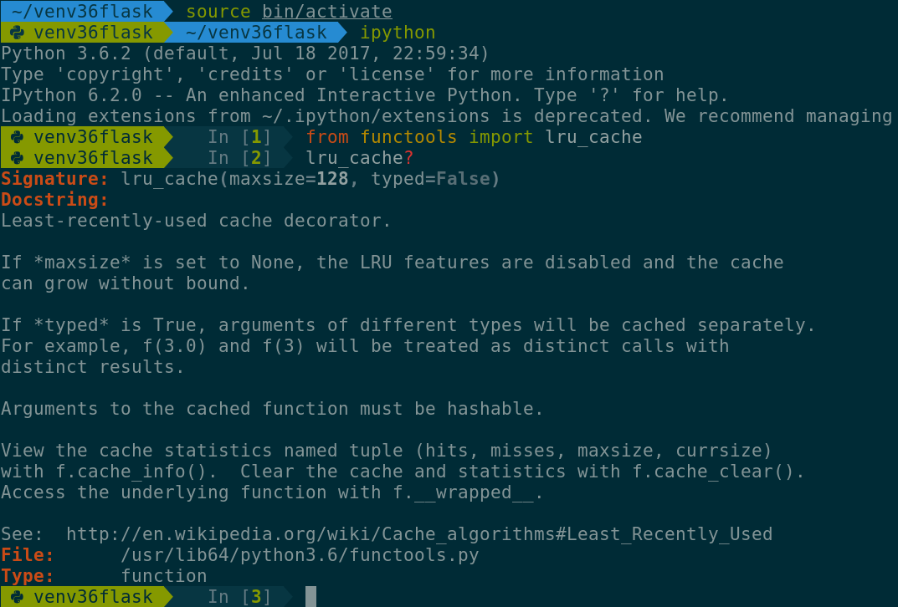

======
IPster
======

A hipster theme for the IPython REPL. |br|
The prompt is based on Agnoster, therefore IPster (IPython + Agnoster).

.. image:: images/ipster-logo.png

IPster is optimized for people who use:

- Solarized colorscheme;
- Unicode-compatible fonts.

For GNOME GNU/Linux users, I highly recommend GNOME Terminal +
Solarized dark + DejaVu Sans Mono Nerd. |br|
For KDE GNU/Linux users, I highly recommend Konsole +
`Solarized Dark <https://github.com/phiggins/konsole-colors-solarized>`_ +
DejaVu Sans Mono Nerd.

Screenshot
----------

Installation
------------

For ``IPython>=0.11`` clone the repository and copy the ``ipster`` module
to the extensions directory (this set up is deprecated)::

    git clone --depth=1 https://github.com/i5ar/ipster.git
    cd ipster
    cp -r ipster "$HOME/.ipython/extensions"

For ``IPython>=5.0`` install the package::

    pip install -U pip setuptools
    pip install ipython-agnoster

Configuration
-------------

Once the module is installed you need to configure it.

Edit your configuration file ``~/.ipython/profile_default/ipython_config.py``::

    ## Use 24bit colors instead of 256 colors in prompt highlighting.
    c.TerminalInteractiveShell.true_color = True

    ## Set the color scheme (NoColor, Neutral, Linux, or LightBG).
    c.InteractiveShell.colors = 'Linux'

    from pygments.token import Token

    # Define prompt colors
    style_overrides_linux = {
        Token.PromptVirtualenv: 'bg:#859900 #002b36',
        Token.PowerlinePromptVirtualenv: 'bg:#073642 #859900',
        Token.Prompt: 'bg:#073642 #657b83',
        Token.PromptNum: 'bg:#073642 #859900 bold',
        Token.OutPrompt: 'bg:#073642 #657b83',
        Token.OutPromptNum: 'bg:#073642 #dc322f bold',
        Token.PowerlinePrompt: 'bg:#002b36 #073642',
    }

    # Override prompt colors
    c.TerminalInteractiveShell.highlighting_style_overrides = style_overrides_linux

For ``IPython>=0.11`` add the following lines::

    # Load extension
    c.InteractiveShellApp.extensions = [
        'ipster.post_0_11'
    ]

For ``IPython>=5.0`` you may use the above set up, but it is deprecated.
It is suggested to import the module directly::

    from ipster.since_5 import IPsterPrompts
    c.TerminalInteractiveShell.prompts_class = IPsterPrompts

Compatibility
-------------

Tmux
~~~~

True color support must be enabled in the configuration file ``~/.tmux.conf``
for Solarized colorscheme to work properly::

  # Override screen 256 color with true color
  set-option -ga terminal-overrides ",xterm-256color:Tc"

If this fix doesn't work your version of Tmux is probably too old.

Roadmap
-------

When using `IPython shortcuts`_ for Vi mode, the current mode indication might
be very helpful. It would be great if IPster could show in a right prompt the
Vi mode.

Contribute
----------

Suggestions and pull requests are welcome.

TODO
----

- Vi mode detection in the `right prompt <https://github.com/jonathanslenders/python-prompt-toolkit/issues/237>`_;

.. _`Python Prompt Toolkit`: http://python-prompt-toolkit.readthedocs.io
.. _`Pygments Solarized`: https://github.com/shkumagai/pygments-style-solarized
.. _`Nerd Fonts`: https://github.com/ryanoasis/nerd-fonts
.. _`Powerline fonts`: https://github.com/powerline/fonts
.. _`IPython shortcuts`: http://ipython.readthedocs.io/en/stable/config/shortcuts/#multi-filtered-shortcuts
.. _`IPython overrides`: http://powerline.readthedocs.io/en/master/configuration/local.html#ipython-overrides

.. |br| raw:: html

     
